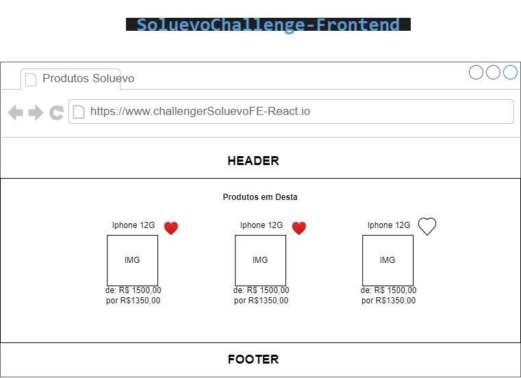

# SoluevoYCChallengeFEReact
O objetivo do desafio abaixo é criar uma aplicação Frontend WEB com React 

O desafio se divide em 2 seções: **Obrigatório e Desejado**. Esperamos que você conclua todas as tarefas da seção **Obrigatório**. Na seção **Desejado** quanto mais itens você concluir mais felizes vamos ficar :)

## O desafio
Precisamos de uma aplicação web que vai exibir uma lista de produtos para que nosso clientes possam ver nosso catalogo de produtos  

**Requisitos de negócio OBRIGATÓRIOS**  
 - Criar uma branch `feature/seu-usuario-github` a partir da `main`;
 - Construir uma landing page que liste produtos com uma opção para favoritar os mesmos; 
 - - pode usar dados estáticos salvos em sessão;
 - - definir 30s de SSG do nextjs; 
 - - Interface produto deve conter: {id, name, imageURL, listPrice, salePrice}

**Requisitos de técnicos OBRIGATÓRIOS**  
 - Usar o framework NextJS;
 - Typescript;
 - Versionar o código na sua branch `feature/seu-usuario-github`;

**Vamos avaliar**
 - Raciocínio lógico; 
 - Conhecimento nas tecnologias web;
 - Documentação, organização e clareza do código;

 **Desejado**
  - Layout responsivo
  - Clean Code
  - Documentação

  ## Mockup Tela

